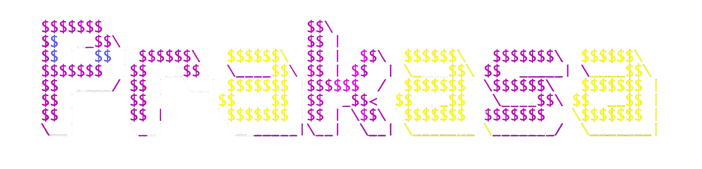

  <h1>Prakasa — Decentralized P2P GPU Inference Network</h1>
  
  
Prakasa (Sanskrit: प्रकाश) — The decentralized "Light" of intelligence.

  

    Prakasa is a decentralized, privacy-preserving P2P GPU inference middleware built on top of the open-source Parallax engine. It leverages the Nostr protocol for resilient, censorship-resistant orchestration and integrates the RIM economic system for trustless, real-time settlements and reputation.
  

  
  
  

## What is Prakasa

Prakasa is a high-performance, privacy-centric P2P GPU inference middleware that transforms idle GPU resources into a unified, resilient intelligence layer. By evolving the Parallax orchestration engine and integrating modern decentralized primitives, Prakasa enables secure, incentivized model deployment across heterogeneous devices.

## Key Pillars

- **Nostr-Powered Orchestration**: Uses the Nostr protocol as a decentralized communication bus.

  - Resilience: No single point of failure for node discovery and task distribution.
  - Privacy: Uses NIP-44/59 (Gift Wrap) for encrypted metadata and secure client-provider signaling.
  - Interoperability: Integrates with the broader Nostr ecosystem for monitoring and management.

- **RIM Economic System**: Robust Incentive Mechanism adapted for P2P compute markets.

  - Atomic Settlements: Real-time micropayments per inference.
  - Market Pricing: Dynamic supply-demand pricing to fairly compensate providers.
  - Sybil Resistance: Staking and reputation to ensure high-quality compute.

- **Privacy & Hardened Security**:

  - Encrypted Payloads: End-to-end encryption of model weights and I/O.
  - Isolated Execution: Stronger containerization for multi-tenant GPU workloads.
  - Verifiable Computation (Roadmap): Zero-knowledge proofs for verifiable results.

- **Evolution of Parallax**: Built on Parallax’s core, extended for global P2P scale.
  - Stateless discovery replacing central APIs with Nostr relays.
  - Modular settlement integrating the RIM protocol.

## Architecture Overview

Prakasa is organized as a middleware stack bridging raw hardware and AI applications:

- **Infrastructure Layer**: Global P2P GPU nodes running the Prakasa-Parallax runtime.
- **Communication Bus (Nostr)**: Task relaying, heartbeat monitoring, encrypted handshakes, and discovery.
- **Settlement Layer (RIM)**: Manages instant value transfers ("Spanda") and on-chain/off-chain reconciliations.
- **Application Layer**: SDKs and APIs for developers to consume compute-as-a-service with privacy and incentives built-in.

## Getting Started

- Installation and local dev instructions: see [docs/user_guide/install.md](./docs/user_guide/install.md)
- Quick start: see [docs/user_guide/quick_start.md](./docs/user_guide/quick_start.md)

## Contributing

We welcome contributions! See the [Contributing Guide](./docs/CONTRIBUTING.md) for how to get started. If you'd like Prakasa to integrate a specific settlement backend, relay implementation, or privacy primitive, please open an issue.

## Notes

- Prakasa is designed as an evolution and distribution of the Parallax project; this repository contains the foundational Parallax engine and components. Prakasa-specific modules (Nostr integration, RIM connectors, settlement adapters) are maintained in dedicated submodules and extensions.

## Supported Models

The project also includes a catalog of supported models and integrations. See the table below for currently supported model families and collections.

|              | Provider     | HuggingFace Collection  |  Blog  | Description |
|:-------------|:-------------|:----------------------------:|:----------------------------:|:----------------------------|
|DeepSeek      | Deepseek     | [DeepSeek-V3.1](https://huggingface.co/collections/deepseek-ai/deepseek-v31)  [DeepSeek-R1](https://huggingface.co/collections/deepseek-ai/deepseek-r1)  [DeepSeek-V3](https://huggingface.co/collections/deepseek-ai/deepseek-v3)  [DeepSeek-V2](https://huggingface.co/collections/deepseek-ai/deepseek-v2) | [DeepSeek V3.1: The New Frontier in Artificial Intelligence](https://deepseek.ai/blog/deepseek-v31) | "DeepSeek" is an advanced large language model series from Deepseek AI, offering multiple generations such as DeepSeek-V3.1, DeepSeek-R1, DeepSeek-V2, and DeepSeek-V3. These models are designed for powerful natural language understanding and generation, with various sizes and capabilities for research and production use. |
|MiniMax-M2    | MiniMax AI  | [MiniMax-M2](https://huggingface.co/MiniMaxAI/MiniMax-M2) | [MiniMax M2 & Agent: Ingenious in Simplicity](https://www.minimax.io/news/minimax-m2) | MiniMax-M2 is a compact, fast, and cost-effective MoE model (230B parameters, 10B active) built for advanced coding and agentic workflows. It offers state-of-the-art intelligence and coding abilities, delivering efficient, reliable tool use and strong multi-step reasoning for developers and agents, with high throughput and low latency for easy deployment. |
|GLM-4.6       | Z AI | [GLM-4.6](https://huggingface.co/zai-org/GLM-4.6) | [GLM-4.6: Advanced Agentic, Reasoning and Coding Capabilities](https://z.ai/blog/glm-4.6) | GLM-4.6 improves upon GLM-4.5 with a longer 200K token context window, stronger coding and reasoning performance, enhanced tool-use and agent integration, and refined writing quality. Outperforms previous versions and is highly competitive with leading open-source models across coding, reasoning, and agent benchmarks. |
|Kimi-K2       | Moonshot AI  | [Kimi-K2](https://huggingface.co/collections/moonshotai/kimi-k2-6871243b990f2af5ba60617d) | [Kimi K2: Open Agentic Intelligence](https://moonshotai.github.io/Kimi-K2/) | "Kimi-K2" is Moonshot AI's Kimi-K2 model family, including Kimi-K2-Base, Kimi-K2-Instruct and Kimi-K2-Thinking. Kimi K2 Thinking is a state-of-the-art open-source agentic model designed for deep, step-by-step reasoning and dynamic tool use. It features native INT4 quantization and a 256k context window for fast, memory-efficient inference. Uniquely stable in long-horizon tasks, Kimi K2 enables reliable autonomous workflows with consistent performance across hundreds of tool calls.
|Qwen          | Qwen         | [Qwen3-Next](https://huggingface.co/collections/Qwen/qwen3-next-68c25fd6838e585db8eeea9d)  [Qwen3](https://huggingface.co/collections/Qwen/qwen3-67dd247413f0e2e4f653967f)  [Qwen2.5](https://huggingface.co/collections/Qwen/qwen25-66e81a666513e518adb90d9e)| [Qwen3-Next: Towards Ultimate Training & Inference Efficiency](https://qwen.ai/blog?id=4074cca80393150c248e508aa62983f9cb7d27cd&from=research.latest-advancements-list) | The Qwen series is a family of large language models developed by Alibaba's Qwen team. It includes multiple generations such as Qwen2.5, Qwen3, and Qwen3-Next, which improve upon model architecture, efficiency, and capabilities. The models are available in various sizes and instruction-tuned versions, with support for cutting-edge features like long context and quantization. Suitable for a wide range of language tasks and open-source use cases. |
|gpt-oss       | OpenAI       | [gpt-oss](https://huggingface.co/collections/openai/gpt-oss-68911959590a1634ba11c7a4)  [gpt-oss-safeguard](https://huggingface.co/collections/openai/gpt-oss-safeguard) | [Introducing gpt-oss-safeguard](https://openai.com/index/introducing-gpt-oss-safeguard/) | gpt-oss are OpenAI’s open-weight GPT models (20B & 120B). The gpt-oss-safeguard variants are reasoning-based safety classification models: developers provide their own policy at inference, and the model uses chain-of-thought to classify content and explain its reasoning. This allows flexible, policy-driven moderation in complex or evolving domains, with open weights under Apache 2.0. |
|Meta Llama 3  | Meta         | [Meta Llama 3](https://huggingface.co/collections/meta-llama/meta-llama-3-66214712577ca38149ebb2b6)  [Llama 3.1](https://huggingface.co/collections/meta-llama/llama-31-669fc079a0c406a149a5738f)  [Llama 3.2](https://huggingface.co/collections/meta-llama/llama-32-66f448ffc8c32f949b04c8cf)  [Llama 3.3](https://huggingface.co/collections/meta-llama/llama-33-67531d5c405ec5d08a852000) | [Introducing Meta Llama 3: The most capable openly available LLM to date](https://ai.meta.com/blog/meta-llama-3/) | "Meta Llama 3" is Meta's third-generation Llama model, available in sizes such as 8B and 70B parameters. Includes instruction-tuned and quantized (e.g., FP8) variants. |
